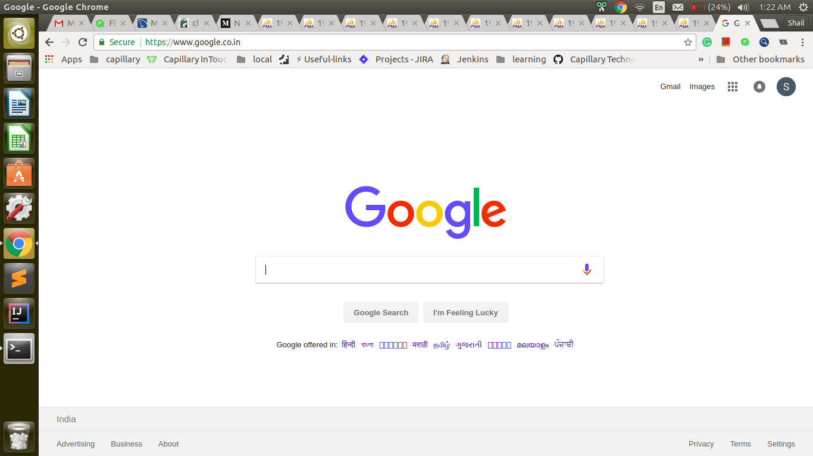

#You can be more efficient while using Chrome!

When I start my work laptop if it was not in sleep mode, I have a specific order to open a few applications. One of the applications is a chrome browser.

I set up my chrome window in specific order for my convenience like the first tab will always Gmail and second flock and later on as per usage GitHub or phpMyAdmin or StackOverflow etc.. I think this much we all might have common among us.

A few days back at one point of time my chrome browser had more than 10 phpMyAdmin tabs were opened for some investigation. And suddenly I found myself unmanageable to fast traverse across tabs in left to right, reopen the closed window, closing current tab using a mouse.

Then I just found below chrome shortcuts very useful and handy. These have really improved my productivity.

Use | command
--- | ---
Close current window | <kbd>Alt</kbd> + <kbd>F4</kbd>
Open a new tab | <kbd>Ctrl</kbd> + <kbd>T</kbd> 
open the last tab you’ve closed.   Google Chrome remembers the last 10 tabs you’ve closed. | <kbd>Ctrl</kbd> + <kbd>Shift</kbd> + <kbd>T</kbd>
Switch to the last tab | <kbd>Ctrl</kbd> + <kbd>9</kbd>
Switch to the next tab | <kbd>Ctrl</kbd> + <kbd>Tab</kbd> or   <kbd>Ctrl</kbd> + <kbd>PgDown</kbd>
Switch to the previous tab | <kbd>Ctrl</kbd> + <kbd>Shift</kbd> + <kbd>Tab</kbd> or  <kbd>Ctrl</kbd> + <kbd>PgUp</kbd>
Close current tab or pop-up | <kbd>Ctrl</kbd> + <kbd>W</kbd> or  <kbd>Ctrl</kbd> + <kbd>F4</kbd>
Switch to the tab at the specified position number.  The number you press represents a position on the tab strip. | <kbd>Ctrl</kbd> + <kbd>1</kbd> through <kbd>Ctrl</kbd> + <kbd>8</kbd>
Make text larger | <kbd>Ctrl</kbd> + <kbd>+</kbd>
Make text smaller | <kbd>Ctrl</kbd> + <kbd>-</kbd> 
Return to normal text size  | <kbd>Ctrl</kbd> + <kbd>0</kbd>

This will not help you when your browser condition is as below.

In this case, you can refer [this](https://zapier.com/blog/chrome-firefox-tab-extensions/) tips and tools.

I will share my other experience which helped me to improve productivity. You can comment any suggestion for improvement or just can Say Hello! :)