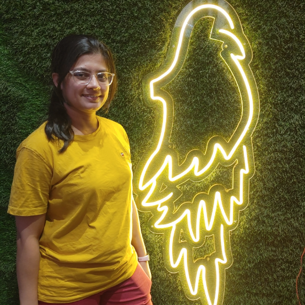

# About Me

I am **Shail Bhatt**. I grab the opportunity to learn form anyone or anything. I enjoy my own company and ideas, but I also like to meet to new people and know their life experiences and learning.  I always think interms of value additioning in my day-today activities. I have natural inclination towards knowing myself or mind or inner journey whatever you want to label it! :) 

I would like to connect with you. Let's enhance eachother learning. You can find me on Twitter [@shail_bhattt](https://twitter.com/shail_bhattt) and [Linkedin](https://www.linkedin.com/in/shail-b-36557a88/) and [instagram #shail_bhattt](https://www.instagram.com/shail_bhattt/) or write an email to shailontech@gmail.com.
I use twitter and linkedin platform more or less to share my technical learnings and instagram to share my personal life experiences and yoga. 

## Work

I work as a  **backend developer** at **Amazon India**. I have total 6+years of Software industry experience. I am fluent in Java language, AWS, Git and System designing. 

****Disclaimer***: *All opinions are mine.*

## What I love

I read the technical books and have curated my youtube and twitter feed in such a way that even during my lazy time also I end up with something amazing in tech news or tips or tutorial. I like to do proof of concept on the new learnings. In this way I learn something quickly. I am little bit methodic person so I do deep dive into the concept to fully understand it before actually using into production.

I love to take part in multiple conferences(like XConf, target-elevate, Linkedin-Conferences, Xdroid, internal amazon conferences) throught out the year to get the direction from mutiple network and forums. 

I explores new field of learning with my current work. Like currently, Apart from comupters, I am learning about Psychology and Equity Trading and Flute. 

## Why this blog?

I will share my learning through the blogs. I have always got small level recogniztion for my notes making on any topic. So I thougth to extend my natural talent to wider audience. I hope you all will get some learning from my blogs.

## More content

Hand around and keep coming back here to see more content.
