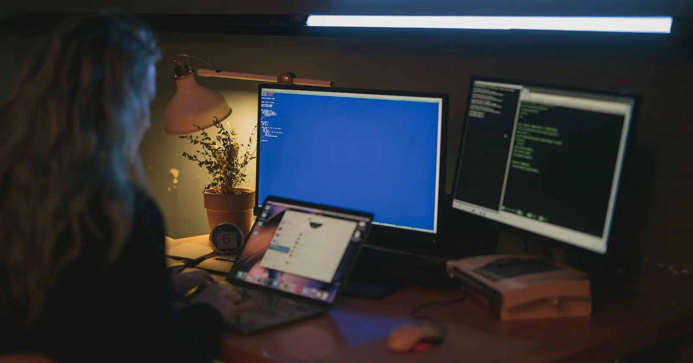

# Becoming an SDE2 at Amazon (my journey)

Hello everyone 👋🏻

I am Shail Bhatt. I currently work as an **SDE 2** at **Amazon India** and have more than 6 years of experience in the IT industry in total. It is a dream come true to be working with such a technically strong company and being able to contribute to its tech but that is just the result. Today, I wanted to take the opportunity to talk about my complete journey that lead to this end result. I am sure it will give some hope to others having the same aspirations as me. 

Let's start from the beginning.

### School days
Would you believe me if I told you that I completed my schooling in a local language (Gujarati)? Yes, you heard me right. Just to give you an example, we used to call Mathematics as **Ganit**, Science as **Vigyan**, and Chemistry as **Rasayan Vigyan** so you can only imagine how different the deeper concepts would sound like in that language. I studied in Gujarati medium school till the 12th class, but after that, I wanted to give competitive exams (**IIT/AIEEE**) a shot. That was because I was one of the state rank holders in my language and thus wanted to see where I stand with respect to others who applied for **NITs** and **IITs**. Also, I thought I could utilize my full potential if I get to study at those institutes. 

### Entrance exams
These entrance exams happen only in 2 languages (Hindi and English) and I did not have any clue about the technical concepts in any of those two languages. Thus, after my 12th result, I wanted to take a gap year and study for competitive exams. With my all ambitions, I planned to take coaching from Bansal Classes, Kota. I did my research and somehow managed to convince my parents to allow me to go to Kota for a year of preps. My teachers and relatives suggested my parents to not allow a gap year and waste money on coaching. But, my father believed in me and allowed me to go. 

During the initial days, language would be a barrier for me. But even before that, coaching institutes have an admission test which you need to pass, and that test is conducted in English. In order to prepare for those, I bought a Gujarati to English dictionary for Maths, Science and Chemistry subjects. Mapping the Gujarati concepts that I knew into English ones, I was able to clear the coaching entrance exams. That was followed by 8 months of rigorous coaching after which I gave the exams but ended up failing in 
 both **IIT** and **AIEEE**. I could not get a good enough rank to clear the BITS exam as well. In another big mistake, I did not give Gujarat state exam(**GUJCAT**) that year and thus, ended up with no calls from any colleges. That was a horrific moment for me. As per the next career options, only a Homesceince or Bachelor of Science degree was open at a time. But luckily at the same time, I started giving some of the private engineering college entrance exams and got a call from Amity University, Jaipur. With no better choices in view, I took an education loan in my name and got admission at Amity for Electronics and Communication Engineering. 

### First job
I completed my engineering degree in 2015, and end up with only a single job offer from Wipro Technologies. I don't want to label that situation but it did not look great. Due to the loan which I needed to pay back, I had to start with something, so I took that job of around 3 lac CTC. Nevertheless, I learned so much at Wipro. Several days of the week, I have worked over 10hrs to really understand software development (Java in depth) & to get to know the way in which the industry works. I got to know pretty soon that in the tech industry, deep expertise is actually rewarded. So that became my purpose: to become a deep expert in whatever small aspect of the project I was working on. 

### First job switch
After spending 2.5 years at Wipro, I wanted to change the company for two main reasons. Firstly, to increase my salary and secondly, to validate the knowledge that I had gained in the last couple of years. I started giving interviews and I got rejected by almost 10 companies. Turns out that the skills to clear an interview was quite different from the skill required to do my day-to-day job well. So I focussed on that skill. Once I focussed on algorithms, data structures, and got good at them, I got an offer from **Capillary Technologies** as a contract employee and at that time my CTC was 9lac (due to a 100 percent hike). 

My job at Capillarytech turned out to be a bigger learning opportunity than I had imagined. I learned about real-world distributed systems, complex backend architectures and worked on implementing them as an individual contributor. I can say that my engineering skills were raised to the next level due to the startup-like environment & some great mentors as my then manager. 

### Joining Amazon
After learning the systems aspect of backend development for more than a year, I thought of trying to test out the waters again and see where my skills stand with respect to the industry. That is when I applied to giants like Google, Amazon which are like dream companies for most of us. 
At that time, I used to think that you need to be very brilliant in order to crack the interviews for those companies and that I did not stand a chance anyway. I even got a call for an Amazon interview once during that time saying that the onsite interview round would be in two days. I got scared and asked for more time and then did not get a call for the entire year. I had learned my lesson that when the next opportunity came, I would just take it without thinking much. 

A year passed on & I got another call for Amazon and at that time I had the courage to say yes. I went back to the basics and worked on my interview skills & cleared the interview. I also cracked some other interviews like **JP Morgan Stanley** and **ADP** but went with the Amazon offer as that was the dream all along. 

It was an unbelievable moment for me. I joined Amazon as an **SDE1** and again found myself in a room with some of the smartest people that I had ever met. But the goal was the same. To become the expert of my subject matter or the task that was assigned to me.  With that principle, I worked hard and learned many new things.  Thanks to some favorable situations and kind people, I got many opportunities to apply my skill in the Amazon ecosystem. And after a year and a half at Amazon, I got promoted to SDE2. I am currently exploring the different aspects of machine learning and I definitely love what I do. 

### Major learnings
If you had asked me a few years ago whether I can imagine myself in the place at which I am today, I would have probably said no. But, I believe there were a few key traits in me that helped me get here, along with a little bit of luck. Here are some of them:

- I enjoy the work that I do. Right from my first job at Wipro to my current job. And thus, I am not afraid to spend a little more time getting to know things a little better when required. 
- I try to do it right rather than do it fast.
- I like to dive deep into the subject rather than having some surface-level knowledge that is sufficient to get the job done. 
- And lastly, I believe I have a little more patience and confidence in myself than the average person.
- I paid attention to my overall health in times of failure and stress. For that, I practice yoga on a regular basis and am also a certified Sri Sri Yoga Teacher. 

### Conclusion
I am writing this article in the hope of trying to convey to others that it is not difficult to reach one's goals. But it is not easy too. The keyword is **consistency**. Throughout my career, I have been consistently setting aside time for my personal learning and development, to give me that little edge over others. Trust me, it does not take much. Just 30 minutes of focussed time daily can do wonders too. So, define your goals, create a routine and stick to it. The rewards will come eventually. 

Cheers! 

Sometimes, I share my life experiences on [LinkedIn](https://www.linkedin.com/in/shail-b-36557a88) and technical learnings on [Twitter](https://twitter.com/shail_bhattt). 
