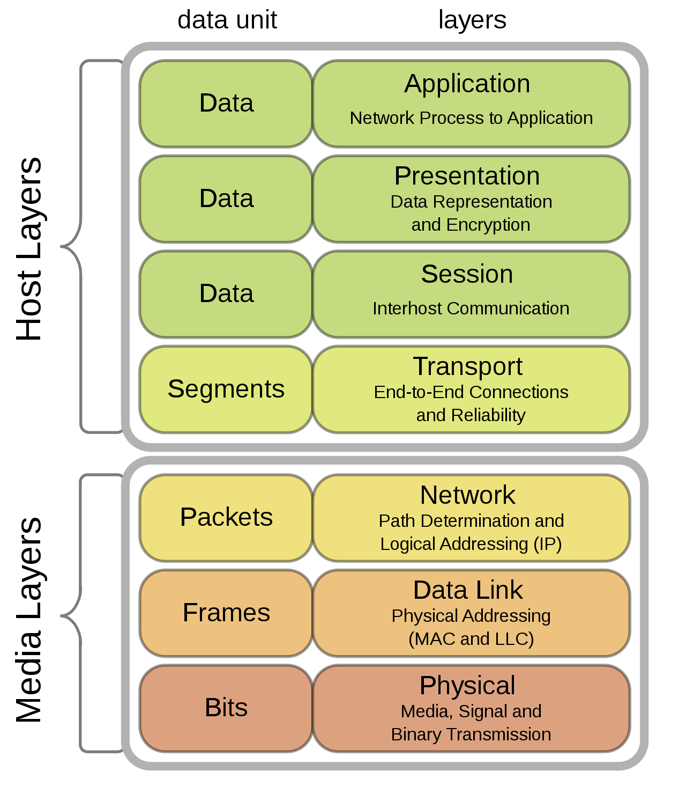

# TCP History and process of communication on network 

##Born of TCP

 TCP was first proposed as an "internetwork Transmission Control Program" in 1974. It was an interface to programs or users that require process to process communication. Processes are viewed as the active elements of all HOST computers in a network. Even terminals and files or other I/O media are viewed as communicating through the use of processes. Thus, all network communication is viewed as inter-process communication.

##Do you wonder how two system or applications communicate with eachother? 
Humans have established process for a communication. Lets take example of two stranger starting the conversation. It generally like both persons will exachange the greeting message like Hi, Helllo, goodmorning and first person will introduce oneself. Another person acknowlwge it and we just share some common topic on which both can communicate. 

Similarly computers can talk with another comuputer with some certain rules, a communication protocol, is nothing but a system of rules that allows two or more entities of a communications system to transmit information via any kind of variation of a physical quantity. 

For establishing comminication with much strict rules of protocol, OSI model was developed. In that protocols are layered to form a protocol stack. The first two cooperating protocols, the Transmission Control Protocol (TCP) and the Internet Protocol (IP) resulted from the decomposition of the original Transmission Control Program, a monolithic communication protocol, into this layered communication suite.   

In telecommunications, packet switching is a method of grouping data into packets that are transmitted over a digital network. Packets are made of a header and a payload. Data in the header is used by networking hardware to direct the packet to its destination, where the payload is extracted and used by an operating system, application software, or higher layer protocols. Packet switching is the primary basis for data communications in computer networks worldwide.

Figure: Protocol stack in OSI model
Source: https://en.wikipedia.org/wiki/Protocol_stack

##What is a connection?
A CONNECTION is fully specified by the pair of SOCKETS at each end since the same local socket may participate in many connections to different foreign sockets.
In general, a socket is the concatenation of a NETWORK identifier, TCP identifier, and PORT identifier. 

https://en.wikipedia.org/wiki/Communication_protocol

I came across really brief history of the internet in this blog by William Craig- https://www.webfx.com/blog/web-design/the-history-of-the-internet-in-a-nutshell/. This nice article.:thumbsup:

